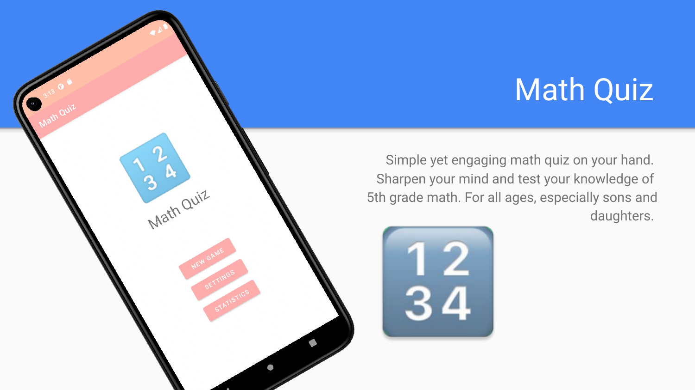
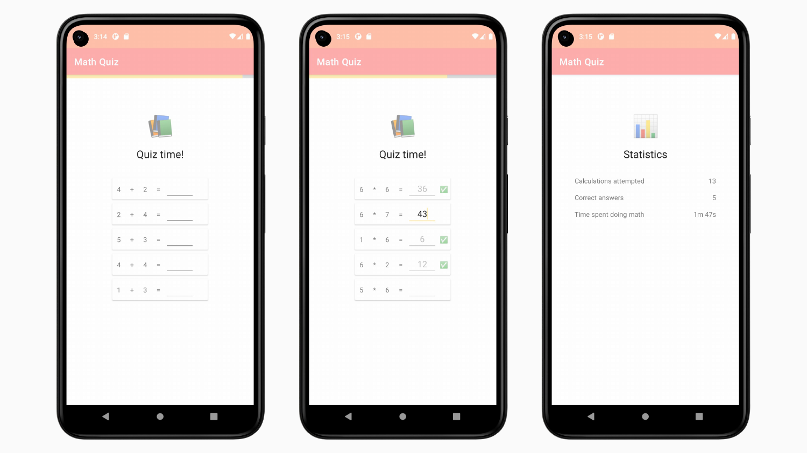

# Math Quiz

Math Quiz brings a minimalistic quiz experience for children learning math. With
16 different difficulty levels to choose from, there is always something for
your kid, regardless of their level. Up for even more challenge? Adjust the
timer through the settings until you feel challenged! Math Quiz is not just fun
for kids, but for all ages!

## ✨ Features

- 📐 16 different difficulty levels.
- ⏱️ Timer to challenge yourself.
- 📊 Statistics to track your progress.
- 😍 Simple and friendly animations that everyone loves.

## 🖼️ Screenshots

